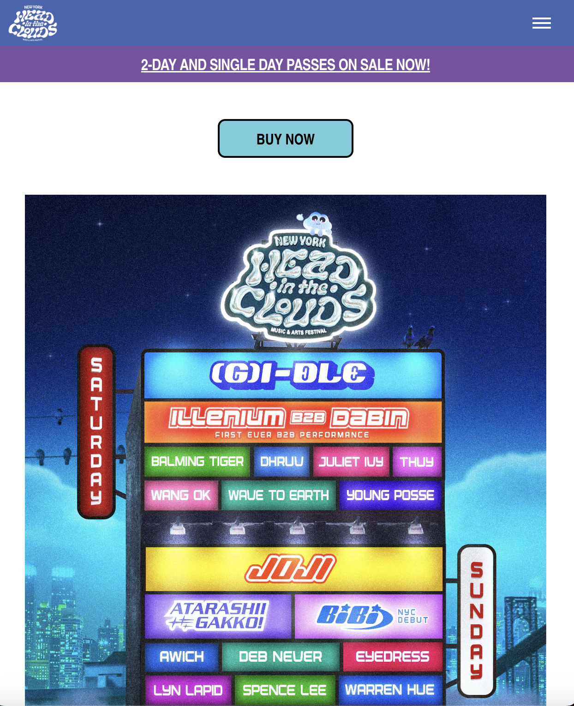
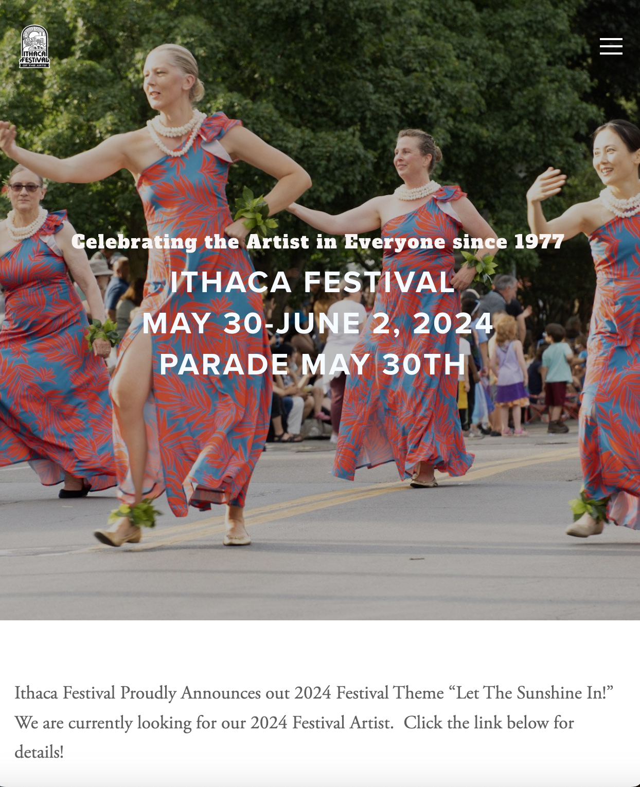
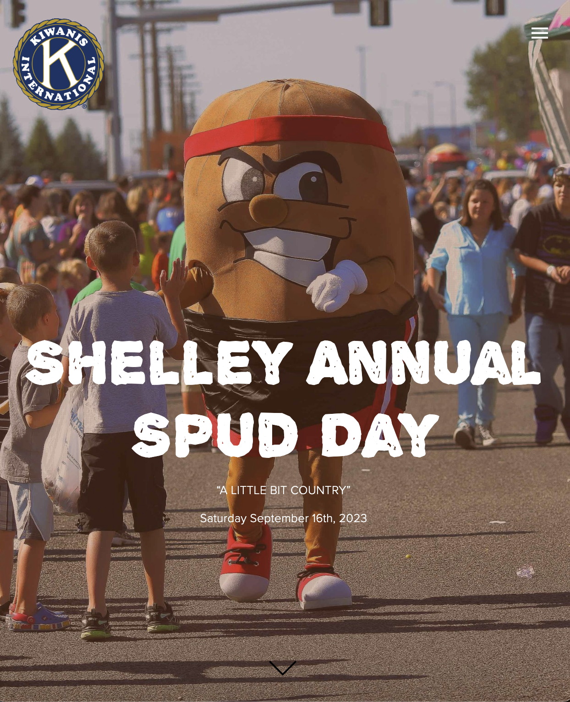
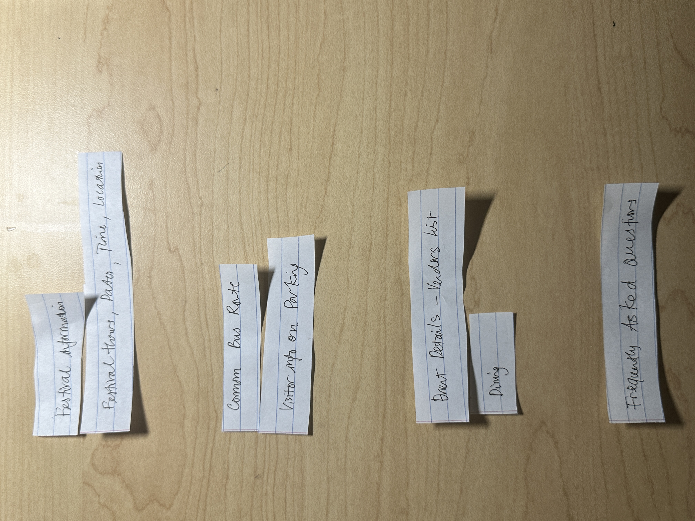
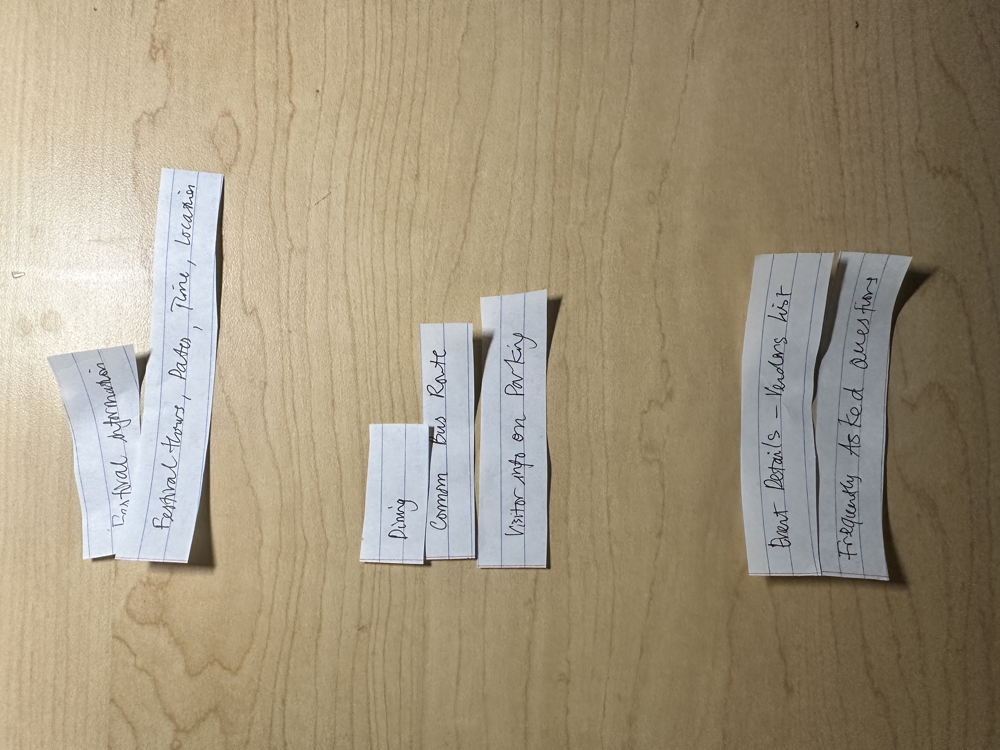
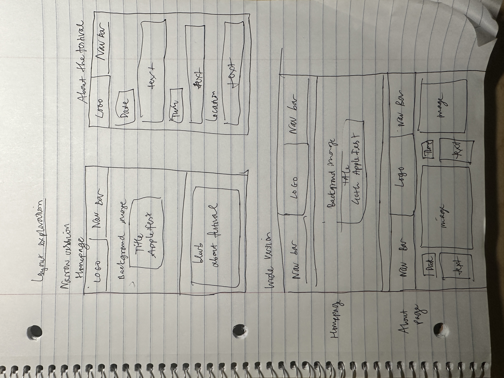
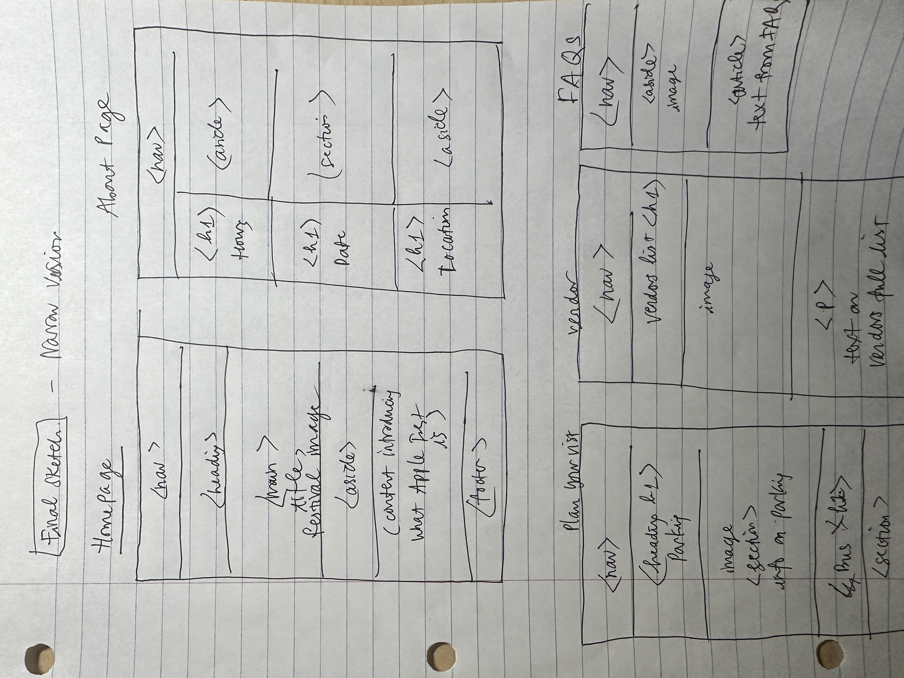
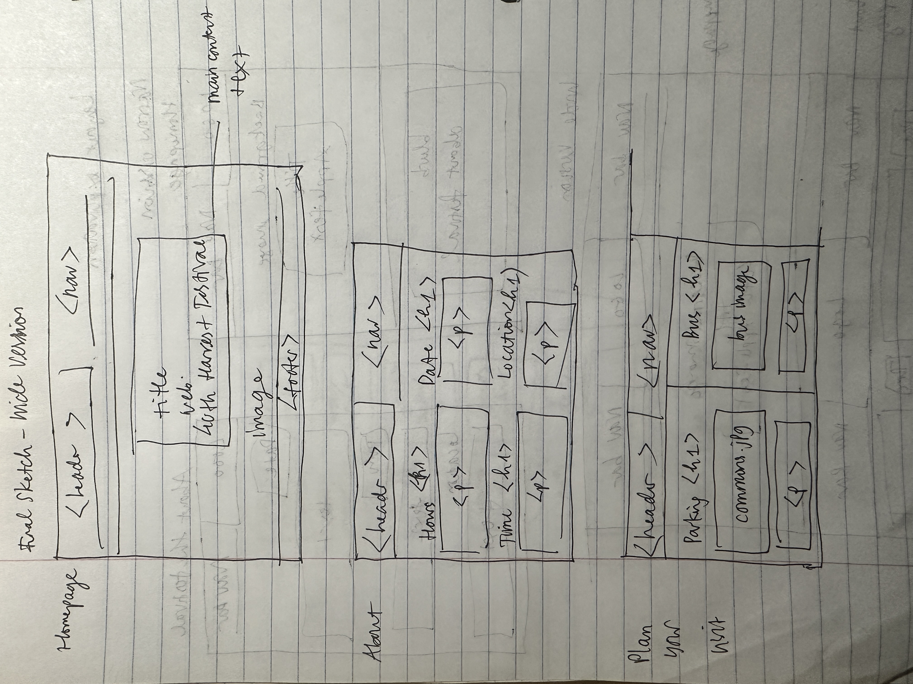
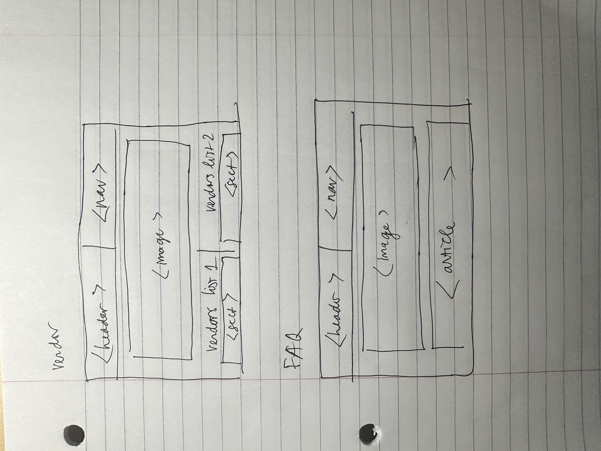

# Project 2: Design Journey

## Understanding Users (Milestone 1)

### User Interview Questions (Milestone 1)

**User Interview Briefing & Consent:** Hi, I am a student at Cornell University. I'm currently taking a class on web design and for a project, I am re-designing the website for Ithaca's Apple Harvest Festival. I'm trying to learn more about the people that might use this site. May I ask you a few questions? It will take about 10 minutes. You are free to quit at any time.

1. Please tell me a bit about yourself. You may omit any personal or private information that you don't feel comfortable sharing.

2. What brought you to visit the Apple Harvest Festival, or other similar events and festivals in Ithaca last time?

3. Before you came to the festival, did you seek out any information about the festival before getting here?
3a. If yes, What information were you specifically looking for? Did you find it? How did you access that information?

4. When you arrived at the festival, did you seek out any information about the festival?
4a. If yes, What was that information? How did you obtain it?

5. While you were there participating in the festival, were you seeking out information about the festival?
5a. What kind of information was particulary useful for a smooth experience for you when you were participating in the festival?

6. Recall the last time you found out about an interesting local event in Ithaca. How did you learn about it?
6a.   What factors influenced your decision to attend Apple Harvest Festival based on the information they display on their sites?

7. What additional inofmration would have made your festival experience more smooth and convenient?

9. What haven't I asked you today that you think would be valuable for me to know?

**After the interview:** This was really helpful. Thank you so much for agreeing to speak with me today. Have a great day!

### Interview Notes (Milestone 1)

**Interviewee 1:**

Lily Yang is a local born and raised in Ithaca, so she is very familiar with all local events that have been happening and organized here. Other examples of festivals she has been to include Ithaca Festival in June, Cider Week New York, Art Trail Open Studio Weekends in October, Chowder Cook-Off in December. She enjoyes festivals, and she usually goes with her family who also lives in Ithaca.

1. Please tell me a bit about yourself.
I'm Lily, born and raised in Ithaca. I've attended our local festivals with my family since I was a child, embracing the vibrant community spirit and enjoying the diversity of activities offered. It's a family tradition for us to explore and participate in various local events, and we all enjoy it together.

2. What brought you to visit the Apple Harvest Festival, or other similar events and festivals in Ithaca last time?
The Apple Harvest Festival has been a family tradition for years, I went as a kid as well, so it's just fun to keep up and go with my family when posisble.

3. Before you came to the festival, did you seek out any information about the festival before getting here?
I usually don't - my parents brought me here as a kid, so I just go with them, even now my parents would be driving me. It's more of a leisure thing for us to do together so no need to prep for anything. We also live here so we know where to get things we want, even if they don't table at the festival, such as good sources to buy food, cooking ingredients. We've also known a lot of good local spots and coffee shops already.

3a. What information were you specifically looking for? Did you find it? How did you access that information?
I don't usually have to look around for information, but if I had to, I would look for basic information such as the dates, and maybe just double-check the location where it's happening. I access the information through just a lot of times going with my family. My parents usually make the decision surrounding parking, and then when we're there we explore different stalls that each of us enjoy! Maybe I also check out weather information for that day.

When you arrived at the festival, did you seek out any information about the festival?
Usually, I'm well-prepared, so I don’t need to seek out much information upon arrival. However, we do check for any last-minute changes or updates, which are typically posted around the festival entrance or available at the information booth.

4a. What was that information? How did you obtain it?
This typically includes checking for any last-minute schedule changes or additional activities that weren't listed online. For example, just really small details such as where I should throw out the trash, like you just have to observe around when you're actually there at the space. If there's a stall that I don't see there, I actually would just ask other people who are there at the event and ask a random stranger "Have you seen..." and then everyone is nice enough to answer.

While you were there participating in the festival, were you seeking out information about the festival?
I remember that as a kid I would always look for kids' activities or family-friendly performances. So I guess for my parents for example, they would love to know that to bring us there, or for other families who want to go for this reason.

5a. What kind of information was particularly useful for a smooth experience for you when you were participating in the festival?
The most useful information for us includes a detailed map of the festival, the schedule of events, especially those suitable for children, and locations of essential services like first aid, restrooms, and food stands.

6. Recall the last time you found out about an interesting local event in Ithaca. How did you learn about it?
 I typically find out about local events throughword of mouth from friends and family because we have so many community members and I grew up here. For annual events like the Apple Harvest Festival, it's such a staple in Ithaca,  that we just rely on tradition and past experiences to remind us of upcoming dates.

6a.   What factors influenced your decision to attend Apple Harvest Festival based on the information they display on their sites?
The key factors that influence our decision include the variety of activities available, especially family-friendly options, the list of vendors, and any unique or new events being introduced. We've been to many and we know that this one would be a pleasant family experience for us all together.

1. What additional information would have made your festival experience more smooth and convenient?
I think an easy navigation for kids friendly activities - that was what I cared the most about as a kid! Specific stalls for shopping for kids, or games or activities, maybe a way to more easily find out abou thtat .

1. What haven't I asked you today that you think would be valuable for me to know?
It would be beneficial to know about the festival's initiatives regarding sustainability and community support. I've been living in Ithaca, and I know Harvest Festival drives a lot of traction to local small businesses from exposure with Cornell and Ithaca College students, so I would love for space to maybe let other people know about that - would be meaningful.

**Interviewee 2:**

Linh Pham is an international student from Vietnam, who has never been to festivals in the US before, and was only a participant in the Apple Fest once because she wanted to join a social gathering with her club of filmmaking on campus. She has a limited budget when coming to festivals like this, prefers to save money, yet still wants to get an enjoyable experiences out of local events within her limited time living in Ithaca.

1. Please tell me a bit about yourself. You may omit any personal or private information that you don't feel comfortable sharing.
  I am an international student from Vietnam, currently studying here in Ithaca. This is my first experience with local festivals as I've never had the chance to attend something like this back home. I'm interested in experiencing different cultures and community events, which is why I decided to attend the Apple Harvest Festival, and it's also a very popular activity for socials for people in my club on campus.

2. What brought you to visit the Apple Harvest Festival, or other similar events and festivals in Ithaca last time?
  I attended the Apple Harvest Festival because I wanted to experience local events and see how festivals are celebrated here. My friends mentioned it was a fun event with good food, and I'm also interested in that and try out new local vendors. My friends from Cambodia also rave about the Cambodian food station in these markets, so I want to try that out as well.

3. Before you came to the festival, did you seek out any information about the festival before getting here?
  Yes, I looked for information online regarding the festival's location, how to get there using public transport, entry fees, and what to expect. I found the website on Google, and just used Google Maps to search about how to use a bus to get there to the Commons as well. Other than that I don't have to do additional search like I would like for example using TikTok to see reviews of music festivals, because there's no entrance fee and it's something low cost and low stakes that I for sure want to try out.

3a.If yes, What information were you specifically looking for? Did you find it? How did you access that information?
  I specifically searched for information on transportation options from my accommodation to the festival, any entry fees, and what food and activities were available.

4. When you arrived at the festival, did you seek out any information about the festival?
  Upon arrival, I looked for information regarding food options, especially those that were affordable, and the locations of different activities within the festival. I wanted to make sure I could try local specialties without overspending and not miss out on interesting events due to lack of information.

4a. If yes, What was that information? How did you obtain it?
  I sought information about affordable food options and the schedule of activities. I think I tried to find if there's like a map standee that I can look at. But in the end I just walked around and that's pretty much enough for me, but definitely a quick map of the market would have been useful.

5. While you were there participating in the festival, were you seeking out information about the festival?
  Yes, I was constantly looking for information about free or low-cost activities, as well as locations for water refill stations to avoid unnecessary expenses. I wanted to enjoy the festival fully without worrying too much about spending money.

5a. What kind of information was particularly useful for a smooth experience for you when you were participating in the festival?
    Detailed maps indicating the locations of free events, restrooms, and water refill stations were particularly useful. Information on scheduled activities would have allowed me to plan my time effectively, for example I wanted to know if I could participate in free workshops or would there be any unique things. Last time I went to a regular market in Ithaca, I saw someone selling poetry and I thought that was cool - I would have loved to see more of that at the festival.

6. Recall the last time you found out about an interesting local event in Ithaca. How did you learn about it?
  Last event I got to know was Chilli Fest. I found about it through my social club at Cornell. My friends usually invite me to go together. And then if I'm interested, I'll search them up on Instagram, or google it and add Cornell to the search query.

6a.   What factors influenced your decision to attend Apple Harvest Festival based on the information they display on their sites?
The factors that influence my decision to attend include the cost of the event, accessibility by public transport, and the availability of activities that align with my interests.

7. What additional information would have made your festival experience more smooth and convenient?
  Additional information that would have enhanced my experience includes a clearer guide on using public transportation specifically for the festival, a list of recommended budget-friendly activities and food options, and perhaps a FAQ section tailored for international students or first-time attendees covering typical concerns such as payment options.

8. What haven't I asked you today that you think would be valuable for me to know?
   Just because I'm international student, I thought maybe if there are international tourists in Ithaca, they would have loved to know about this as well. So maybe multiple languages using Google autotranslate to allow people to view information about the website in different languages.

**Interviewee 3:**

Andrew Xu is an undergraduate student from California, USA. He is now a senior at Cornell, so he has been to 2 Apple Fests. He doesn't have too much of an invested interest in Festivals, but would go for socials with friends. He has more experiences and preferences for festivals like music, for example Heads in The Clouds concert, and really enjoy the experiences there, from learning about them online, to attending the event in person, and getting to know what's there.

1. Please tell me a bit about yourself. You may omit any personal or private information that you don't feel comfortable sharing.
  I am an undergraduate student originally from California. I enjoy exploring new cultures and experiences, which is why I moved to Ithaca for my studies. Although I occasionally attend festivals, I prioritize like music festivals. But Ithaca Apple Fest is also fun.

2. What brought you to visit the Apple Harvest Festival, or other similar events and festivals in Ithaca last time?
  The Apple Harvest Festival caught my attention due to its emphasis on local produce, I cook sometimes and I want to buy fresh ingredients there. There's not much to do in Ithaca, so when there are events like this, I enjoy going.

3. Before you came to the festival, did you seek out any information about the festival before getting here?
 Yes, I usually serach things up a bit before I go anywhere. I was particularly interested in learning about the vendors who would be there, the types of products available.

3a. If yes, What information were you specifically looking for? Did you find it? How did you access that information?
   I specifically sought out information on a list of local farmers and artisans participating. I accessed this information through the festival's official website. While I found some of the information I was looking for, I wished there were more detailed profiles on the vendors and their works.

4. When you arrived at the festival, did you seek out any information about the festival?
    Upon arrival, I sought out additional information on any last-minute changes to the workshop schedules, locations for specific vendors, and any interactive or, educational booths. Not much other than that, not really parking because Ithaca Commons is so close by.

4a. If yes, What was that information? How did you obtain it?
  I felt that real-time updates were somewhat lacking, especially for sudden schedule changes due to weather or other unforeseen circumstances. But most of the festival was just vendors and usually we just browse around.

5. While you were there participating in the festival, were you seeking out information about the festival?
  I wish there was a list or repository where I could go back and revisit some of the local brands that were showcasing there! Maybe I want to visit them another time, or go to their local store again besides just seeing them at the market, but I don't remember all of their names.

5a. What kind of information was particularly useful for a smooth experience for you when you were participating in the festival?
  Information on the location and timing of specific workshops, as well as a map highlighting sustainable vendors, would be particularly useful.

6. Recall the last time you found out about an interesting local event in Ithaca. How did you learn about it?
  I last found out out about local events through Slack channels from my clubs to ask people to go together, social media because my friends post stories about it.

6a.   What factors influenced your decision to attend Apple Harvest Festival based on the information they display on their sites?
I'm also interested in sustainability actually. So my decision to attend is also heavily influenced by the event's focus on sustainability, the involvement of local farmers and artisans. I look for detailed information about whether the event supports local businesses and practices.

7. What additional information would have made your festival experience more smooth and convenient?
  An interactive map featuring vendor locations would be on top of my mind for now. And as I shared before as well, maybe a list of vendors that I can check back on whenever I want to reaccess the list of vendors I saw from the festival and want to repurchase something from them.

8. What haven't I asked you today that you think would be valuable for me to know?
 I generally enjoy to learn about events through words of mouth, especially through friends who went there, and then gave me a review after, then I'd check out the websites. 

### Goals (Milestone 1)

Goal 1: Enhance Festival Experience

Design Ideas and Choices: Create an intuitive, user-friendly website with a detailed map of the festival, scheduled events, and vendor information, ensuring updates are easily accessible.
Rationale & Additional Notes: This addresses the needs of all three interviewees, providing essential information like locations, schedules, and updates to enhance their festival experience.

Goal 2: Cater to Diverse Visitor Needs - international students, families, locals

Design Ideas and Choices: Incorporate sections for family-friendly activities, budget-friendly options, and unassuming that everyone is a local.

Rationale & Additional Notes: Responds to the varied backgrounds and needs of the interviewees, making the festival more accessible and enjoyable for families, budget-conscious students, and international visitors.

Goal 3: Promote Local Community and Sustainability

Design Ideas and Choices: Feature local vendors and sustainable practices prominently on the website, including profiles and links to their businesses.
Rationale & Additional Notes: Supports Andrew's interest in sustainability and the community aspect important to Lily and Linh who are interested in fostering local engagement and ethical practices.

### Audience (Milestone 1)

The site's cohesive audience includes Ithaca residents and temporary visitors who are interested in Ithaca Apple Harvest Festival, Specifically, this group includes local Ithaca residents, international students, and visitors looking to participate in community events. They share common goals of enjoying local-orientated and family-friendly activities in the festival.

## Festival/Event Website Design Exploration (Milestone 1)

Identify three festival or event websites (preferably static websites) that exist today on the web. You will be drawing inspiration from these sites for your own site; please select websites that are similar to the website you wish to create.

Include **two** screenshots of the home page for each site: **narrow and wide**.

**We'll refer to these are your "example websites."**

1. <[Head in the Clouds concert](https://ny.hitcfestival.com/)>

    

    

2. <[Ithaca Festival](https://ithacafestival.org/)>

   

   

3. <[Idaho Spud Day](https://www.idahospudday.com/#intro)>

    

    

### Festival/Event Website 1 Review (Milestone 1)

The Heads In The Cloud Festival website features a modern, user-friendly that aligns with their core audience of young people and concert lovers. The site uses strong contrast between background and foreground elements to enhance readability and draw attention to key areas, such as event dates and ticket information, they chose a clear white background with blue being their main contrast theme color. The hierarchy is well established through varying text sizes and colors, signaling the importance of different sections. Repetition is used effectively in the navigation and footer areas, The nav bar is also easy - and the search function for artist is clearly laid out in the center for people to search if their favorite artist is perfoming in the upcoming concerts .

Critique: The website excels in creating an engaging user experience with its clear layout and easy navigation. The use of contrast makes text easily legible against background images. However, in some sections, text over images could be improved for better readability, but I do understand that some are for artistic purposes and want to maintain the aesthetics of the singers.

### Festival/Event Website 2 Review (Milestone 1)

Ithaca Festival's compared to the first website uses a more traditional, community-oriented design for family audiences. The site's design patterns show good alignment, with elements neatly organized, providing a structured flow for users. However, I think the fonts are quite boring and the font families don't work super well with each other. The body text seems to corporate, while the main fonts are a bit playful. The color scheme also is too basic, just black and white, while the main colors of the website are real photos and the color schemes appear as messy.

### Festival/Event Website 3 Review (Milestone 1)

The Idaho Spud Day website offers a friendly and straightforward user experience, reflective of the event's character - fun, quirky, and a lot of Idaho pride. While the design successfully communicates the festival's homely and local atmosphere, enhancing contrast for better readability would improve the overall user experience. They have great combination of alignment throughout the main website, I also like how the font families complement each other to create a funky and funny atmosphere for excited readers.

## Content Planning (Milestone 1)

Plan your site's content.

### Your Site's Planned Content (Milestone 1)

These are the main types of content I'll be using, extracted from m-content:
- Apple Fest Introduction
- Frequently Asked Questions
- Dining
- 40th Annual Apple Harvest Festival date, time, location
- Festival Hours
- Directions & Parking
- Vendors List
- Some common bus routes that lead to Ithaca Commons for college students (cut out irrelevant/ uncommon bus routes and schedules)
Images:
- apple-jars.jpg
- apple-wines,pjg
- applepies.jpg
- apple-basket-many.jpg
- apple-harvest-map.svg
- commons-far.jpg
- commons.jpg
- cider-apples-stand.jpg

### Content Justification (Milestone 1)

The outlined content directly addresses the goals and preferences of our diverse audience, including local residents, international students, and visitors unfamiliar with the area. By providing a comprehensive introduction to the Apple Fest, detailed FAQs, dining options, and specific festival details like dates, times, and locations, the content meets the informational needs identified from audience interviews. Including practical information such as festival hours, directions, parking, and common bus routes specifically caters to logistical concerns, enhancing the overall visitor experience and accessibility. The vendor list caters to those interested in local crafts and foods, aligning with the community-focused interests observed in the interviews. This thoughtful compilation of content ensures that all site visitors, regardless of their familiarity with the event or locale, can find the information they need for a rewarding festival experience. Also, for the bus route, we cut out only relevant routes based on the information that most Ithaca residents are well aware of the bus route, or have their own car - it's mainly Ithaca College and Cornell University students who would be using this information. As for the photos I selected, I chose enough photos to decorate the website.

## Information Architecture (Milestone 1)

### Content Organization (Milestone 1)

In the first iteration, I categorized the content into logical groups based on themes and different aspects of the festival: Festival Information (Apple Fest Introduction, Festival Hours, Date, Time, Location), Visitor Information (Directions & Parking, Common Bus Routes), Event Details (Vendors List), and Visitor Services (Dining, Frequently Asked Questions).

The cards were sorted into four main categories, each representing a critical aspect of the festival experience. The layout intended to guide users sequentially from understanding the festival to planning their visit, then exploring the event, and finally resolving any specific inquiries. However, feedback indicated that some users found it confusing to differentiate between Festival Information and Event Details, as they considered all information about the event as a single unit.

In the second iteration, I combined Festival and Event details into one category, resulting in three main groups: General Festival Information (Apple Fest Introduction, 40th Annual Apple Harvest Festival date, time, location, Festival Hours), Plan Your Visit (Directions & Parking, Common Bus Routes, Dining), and Festival Features (Vendors List, Frequently Asked Questions).

This organization uses the design pattern of going through a chronological users' search for information, assuming they might want to first understand what the festival is about, then how to get there, and lastly, what they can do or find at the festival. Cards were sorted with a user's journey in mind, from getting to know the festival, to planning their visit, to finally exploring specific festival offerings.

### Final Content Organization (Milestone 1)

I will use the organization from Iteration 2 for the final website.

This structure aligns better with the audience's needs, simplifying the navigation by consolidating similar types of information and reflecting a natural event-going process, and addressing the chronological logical user thinking pattern. This ensures that everyone, from locals to international visitors, can find the information they need efficiently and intuitively.

### Navigation (Milestone 1)

- Home
- About the Festival (Apple Fest Introduction, 40th Annual Apple Harvest Festival date, time, location, Festival Hours)
- Plan Your Visit (common bus route, parking, dining)
- Vendors & Activities (Vendors list)
- FAQs

These page names were chosen for clarity and relevance to our audience's needs. 'Home' offers a starting point; 'About the Festival' provides background and general information, setting the scene; 'Plan Your Visit' covers all logistical aspects, crucial for both local and international attendees; 'Vendors & Activities' caters to those interested in exploring the festival's offerings; and 'FAQs' addresses common queries, ensuring users have all necessary details for a pleasant festival experience. This nomenclature makes sense for our audience as it directly corresponds to their informational needs and objectives identified through interviews and card sorting exercises.

## Visual Theme (Milestone 1)

1. Formal, Minimalist Style: This theme utilizes a clean and sophisticated aesthetic, focusing on ample white space, minimal design elements, and a color palette of black, slate gray, and accents of apple red (Hex #FF0000) for contrast.

Imagery would be minimalistic, and I will prioritize images with more of nature, than people, to create a clean look.
Shapes in the design would be geometric, with sharp edges to convey a sense of order and elegance.
Typography would lean towards modern, sans-serif fonts such as Helvetica Neue for body text (light to regular weights) and Futura for headings (medium to bold weights), providing clear readability and a professional appearance.
This theme caters to an audience that appreciates straightforward information and a polished look.

2. Nature, Refreshing, and Family-Friendly Style: This theme would exude a welcoming and refreshing vibe using a color palette of grass green (Hex #7CFC00), sky blue (Hex #87CEEB), and sunshine yellow (Hex #FFD700), creating a lively and inviting environment.
Imagery would focus on outdoor scenes, families enjoying the festival to enhance the friendly atmosphere.
Typography would combine a readable, relaxed font like Open Sans for body text (light to regular weights) with a more playful, rounded font like Nunito.

3. Funky and Fun Style: I thought of this theme for a younger or more eclectic audience, this theme would feature vibrant colors like hot pink (Hex #FF69B4), electric blue (Hex #7DF9FF), and lime green (Hex #32CD32), creating a dynamic and energetic atmosphere.
Imagery would be a combination of family photos and nature photos.
Typography would pair a bold, eye-catching font like Playfair Display for headings and aesthetics, and playful font like Roboto for body text (regular weight), ensuring readability while maintaining a fun, informal tone.

Based on audience goals and feedback, the Nature, Refreshing, and Family-Friendly Style will be adopted for the Ithaca Apple Festival website. This theme aligns with the desire for a welcoming, community-oriented atmosphere highlighted in the interviews. The color scheme of grass green, sky blue, and sunshine yellow mirrors the natural beauty of Ithaca and the festival's autumn setting, ideal for attracting families and environmentally-conscious visitors. The combination of Open Sans and Baloo fonts offers a balance between readability and warmth, suitable for a festival celebrating harvest and community. This visual theme encapsulates the essence of the festival and appeals directly to the target audience, emphasizing the event's family-friendly, natural, and inclusive atmosphere.

## Design (Milestone 1)

### Layout Exploration (Milestone 1)

Explanation:

For the narrow version, at the top, there's a simple navigation bar, below this, a large carousel slider showcases vibrant images from previous festivals.

Wide Version Sketch:
The navigation bar extends horizontally, including clear, clickable links to each main section.

These sketches explore responsiveness and clarity. The narrow version prioritizes vertical space and readability on smaller screens, while the wide version utilizes the extra space to reduce user scrolling and enhance navigation. Both versions maintain a consistent use of colors and fonts, aligning with the Nature, Refreshing, and Family-Friendly theme. I want the audience, who are people who could be unfamiliar with the festival to have a lot of visual aids to imagine the festival - that's why my layout prioritizes large size images and minimal and smaller portion for bodies of text .

### Final Design (Milestone 1)

**Narrow (Mobile) Design:**

For the final mobile design, I decided to implement a straightforward navigation bar at the top, including a clear festival logo, which caters to the typical mobile user's need for simple, one-handed navigation. I also took into consideration the limited screen space and the context in which mobile users often find themselves—on the go or multitasking. This approach acknowledges the mobile users' preference for quick, accessible information and their likely shorter attention span compared to desktop users. The natural instinct for this layout is to also scroll down for more information.

**Wide (Wide) Design:**

The design for the desktop version employs a consistent top navigation bar with all section links visibly laid out, catering to desktop users' expectations for easy, direct access to different parts of the site. This method leverages the larger screen real estate to enhance discoverability and reduce the number of clicks needed to navigate. Because there's more horizontal space, I can opt for a more optimized use of space by having multiple columns on a few pages where in the narrow version I would have just laid out vertically in chronological order for the user to scroll downwards. I am also more generous with image space.

### Design Rationale (Milestone 1)

I employed  design patterns like clear visual hierarchy (a lot of images for new audiences), consistent navigation (style consistency, always have same nav bar at top of ever page), to enhances user experience by making the site intuitive and user-friendly.

The navigation is designed to be immediately understandable and I placed it at the top to reduce user effort and aligning with their expectations based on common web conventions. I also laid out the content organization like how my thinking flow in the previous step of the milesotne.

Overall, the final design decisions cater to the diverse needs of the festival's audience, balancing between the immersive, detailed exploration desired by desktop users and the quick, accessible information needed by mobile users. The layout ensures that key information is front and center, addressing the primary goals of different user groups: learning about the festival, planning their visit, and exploring activities and vendors, for both locals, families, students, or even international visitors like I interviewed.

## User Testing (Final Submission)

### User Testing Tasks (Final Submission)
> Plan out your user testing tasks before doing your user testing.
> These must be actual user testing tasks.
> **Tasks are not questions!**

1. TODO: task 1

2. TODO: task 2

### Participant 1 (Final Submission)
> Using your notes from above, describe your user by answering the questions below.

1. Who is your user, e.g., where does the user come from, what is the user's job, characteristics, etc.?

    TODO: tell us about the participant

2. Does the user belong to your audience of the site?

    > If “No”, what’s your strategy of associating the user test results to your audience’s needs and wants? How can your re-design choices based on the user tests make a better fit for the audience?

    TODO: (Yes / No)

### Participant 1 -- Testing Notes (Final Submission)
> When conducting user testing, you should take notes during the test.

TODO: participant user test notes

### Participant 2 (Final Submission)
> Using your notes from above, describe your user by answering the questions below.

1. Who is your user, e.g., where does the user come from, what is the user's job, characteristics, etc.?

    TODO: tell us about the participant

2. Does the user belong to your audience of the site?

    > If “No”, what’s your strategy of associating the user test results to your audience’s needs and wants? How can your re-design choices based on the user tests make a better fit for the audience?

    TODO: (Yes / No)

### Participant 2 -- Testing Notes (Final Submission)
> When conducting user testing, you should take notes during the test.

TODO: participant user test notes

### Potential Changes Based on User Testing (Final Submission)
> What changes would you make to your design based on user testing?
> Note: You are not required to change your design. Simply tell  us what you would change.

TODO: user testing reflection

## Rationale (Final Submission)

**This rationale should be polished writing:** one you might submit as a report to a client or boss to help explain the project and convince them you did a good job. You'll be surprised how much writing and communicating you need to do about projects and choices on internships and jobs; practice that here.

It should be a comprehensive, complete story of the project. You might find that each section runs about a paragraph. Sketches can often help tell the story of your design.

Your rationale should be a polished version of the earlier explanations.

### Audience (Final Submission)
> A complete and polished description of the intended audience(s) for your website.

TODO: audience rationale

### Audience Goals
> Explain how your site's design addresses the goals of the audience.

TODO: goal rationale

### Visual Design (Final Submission)
> An explanation of how the final design is appropriate for your audience.
> Include design patterns in your rationale.

TODO: design rationale

### Self-Reflection (Final Submission)
> Take some time here to reflect on how much you've learned since you started this class. It's often easy to ignore our own progress. Take a moment and think about your accomplishments in this class. Hopefully you'll recognize that you've accomplished a lot and that you should be very proud of those accomplishments!

TODO: self-reflection

## Grading (Final Submission)

### Collaborators
> List any persons you collaborated with on this project.

TODO: list your collaborators

### Reference Resources
> Please cite any external resources you referenced in the creation of your project.
> (i.e. W3Schools, StackOverflow, Mozilla, etc.)

TODO: list reference resources
